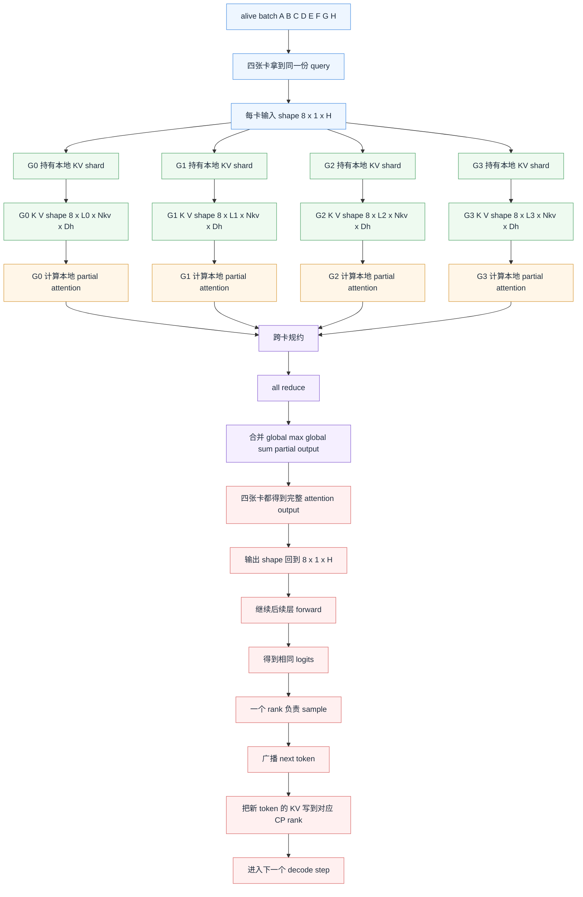

# Kimi DCP + MTP 学习记录

## 1. 先搞清楚什么是 CP

这里的 `CP` 指的是 `Context Parallel`。

它的核心思想是：**不是把模型参数切到多张卡上，而是把同一条请求的上下文序列切到多张卡上一起算。**

可以先和 `TP` 对比着理解：

- `TP`（Tensor Parallel）切的是模型内部张量，比如 hidden dimension、attention head、FFN 权重。
- `CP`（Context Parallel）切的是序列维度，也就是 prompt / KV cache 对应的那条长上下文。

如果一条请求很长，单卡放不下，或者 decode 阶段 KV cache 压力很大，就可以把这条序列按长度分片到多张卡上。这样每张卡只负责一部分 token 对应的 KV / attention 计算。

CP里面的一种token分配方式叫 interleave 或者叫 round-robin 假设有4个CP rank，那么token就是这样分布的

- rank 0: 0, 4, ...
- rank 1: 1, 5, ...
- rank 2: 2, 6, ...
- rank 3: 3, 7, ...

这样的话不容易某个卡负载太高直接爆掉显存。

## 2. 那 DCP 是什么

`DCP` 一般指 `Decode Context Parallel`，也就是 **把 CP 主要用在 decode 阶段**。

原因很直接：

- 在长上下文推理里，真正容易顶爆显存的往往不是参数，而是 `KV cache`。
- 尤其到了 decode 阶段，请求会持续增长，历史 token 越来越长，KV cache 会越来越大。
- 这时候如果只靠 `TP` 扩卡，很多场景下并不能等比例缓解 KV cache 压力。

所以 `DCP` 的思路是：

- 让多张卡共同承担同一条请求的上下文状态；
- 每张卡只保存和计算自己那一段上下文对应的 KV；
- 在 attention 需要全局信息时，再做跨卡通信和聚合。

一句话说，**DCP 是把“长上下文带来的 KV 压力”沿着序列维度拆开。**

### 2.1 一个更具体的场景：4 张卡，同时跑多条 seq，而且有长尾和短尾

假设现在有 4 张卡：

- `G0`
- `G1`
- `G2`
- `G3`

它们组成一个 `DCP group`，每张卡都是一个 `CP rank`。

再假设现在 decode batch 里同时有 8 条 seq：

- `A`: prompt 很长，后面还会继续生成很多 token，是长尾
- `B`: 很快就会结束，是短尾
- `C`: 中等长度
- `D`: 下一步就可能结束，是超短尾
- `E`: 特别长，是最长尾
- `F`: 短尾
- `G`: 中尾
- `H`: 短尾

这时需要先纠正一个很容易产生的误解：

- **不是** `A~H` 先都放在 `G0` 上算，等长度太长了再搬到 `G1/G2/G3`
- **而是** 从 decode 一开始，`A~H` 这 8 条 seq 的 KV 就已经按 `CP` 规则分散在 4 张卡上

如果用的是 `interleave / round-robin`，那么一条 seq 的 token 位置可能是这样分布的：

- `rank 0`: 0, 4, 8, 12, ...
- `rank 1`: 1, 5, 9, 13, ...
- `rank 2`: 2, 6, 10, 14, ...
- `rank 3`: 3, 7, 11, 15, ...

也就是说，对同一条 seq 来说：

- 它不是完整地待在某一张卡上
- 而是它的 KV 从一开始就拆开，分别放在 `G0/G1/G2/G3`

### 2.2 第一个 decode step 在干什么

假设当前 alive batch 是：

`A, B, C, D, E, F, G, H`

再假设：

- `cp_size = 4`
- 当前是标准 decode：每条活跃 seq 这一步只喂 **1 个 query token**
- 模型某一层的 hidden size 记成 `H`
- attention 的 query head 数是 `Nq`
- KV head 数是 `Nkv`
- 单头维度是 `Dh`
- 那么有 `H = Nq * Dh`

那么这一个 decode step 里，4 张卡做的事情不是串行的，而是并行的：

1. `G0/G1/G2/G3` 会同时参与这 8 条 seq 的这一步 forward
2. 每张卡只读取这 8 条 seq 在自己本地持有的 KV shard
3. 每张卡先算出本地的 partial attention 结果
4. 然后通过跨卡通信，把这些 partial result 聚合成完整 attention 输出
5. 再继续走后续层，最后为 `A~H` 每条 seq 产出一个 next token

所以 DCP 的关键点不是“哪张卡先算”，而是：

- **每个 decode step，4 张卡一起算**
- **每张卡算的是同一批 seq，但只算自己本地那部分 KV**

#### 2.2.1 如果只看输入到这一层时的 hidden states

因为 alive batch 里有 8 条 seq，而且 decode 每条 seq 当前只推进 1 个 token，所以这一层输入的逻辑形状可以写成：

- 全局：`[B, 1, H] = [8, 1, H]`

在 DCP 下，这 **8 条 seq 并不会按 batch 维切成 2 条、2 条、2 条、2 条分给 4 张卡**。

相反，4 张卡上通常都会各自拿到这 8 条 seq 当前 step 的 query 表示，也就是：

- `G0` 上这一层的输入 hidden states：`[8, 1, H]`
- `G1` 上这一层的输入 hidden states：`[8, 1, H]`
- `G2` 上这一层的输入 hidden states：`[8, 1, H]`
- `G3` 上这一层的输入 hidden states：`[8, 1, H]`

也就是说：

- **batch 维没有被 DCP 切开**
- **被切开的是每条 seq 的历史上下文 KV**

#### 2.2.2 四张卡上各自持有的 K/V cache 形状

对这 8 条 seq，设它们当前长度分别是：

- `L_A, L_B, L_C, L_D, L_E, L_F, L_G, L_H`

那么总的历史长度是按 seq 各自分开的，不是简单拼成一条超长序列。对任意一条 seq `s`，在 `cp_size = 4` 的 round-robin DCP 下，第 `r` 张卡持有的 token 数大约是：

- `L_s^(r) ≈ ceil((L_s - r) / 4)`（更准确地说是该 seq 中满足 `pos % 4 == r` 的位置数）

因此在某一层上：

- `G0` 持有的 K cache 形状可写成：`[8, L^(0), Nkv, Dh]`
- `G1` 持有的 K cache 形状可写成：`[8, L^(1), Nkv, Dh]`
- `G2` 持有的 K cache 形状可写成：`[8, L^(2), Nkv, Dh]`
- `G3` 持有的 K cache 形状可写成：`[8, L^(3), Nkv, Dh]`

V cache 同理：

- `G0`：`[8, L^(0), Nkv, Dh]`
- `G1`：`[8, L^(1), Nkv, Dh]`
- `G2`：`[8, L^(2), Nkv, Dh]`
- `G3`：`[8, L^(3), Nkv, Dh]`

这里的 `L^(r)` 不是单个固定值，而是“这 8 条 seq 在 rank r 上各自本地长度”的简写。若为了直觉化、先假设这 8 条 seq 当前长度都差不多是 `L`，那么每张卡本地大约就是：

- `G0`：K/V cache 约为 `[8, L/4, Nkv, Dh]`
- `G1`：K/V cache 约为 `[8, L/4, Nkv, Dh]`
- `G2`：K/V cache 约为 `[8, L/4, Nkv, Dh]`
- `G3`：K/V cache 约为 `[8, L/4, Nkv, Dh]`

这就是 DCP 真正“切掉”的那一维：**sequence length / KV cache length**。

#### 2.2.3 这一层 attention 里四张卡各自 forward 的张量形状

先看 query。因为当前 step 每条 seq 只解 1 个 token，所以在 4 张卡上，本地 query 的形状通常都是：

- `Q on G0`: `[8, 1, Nq, Dh]`
- `Q on G1`: `[8, 1, Nq, Dh]`
- `Q on G2`: `[8, 1, Nq, Dh]`
- `Q on G3`: `[8, 1, Nq, Dh]`

而每张卡上的本地 K/V 是它自己持有的 shard：

- `K on G0`: `[8, L^(0), Nkv, Dh]`
- `K on G1`: `[8, L^(1), Nkv, Dh]`
- `K on G2`: `[8, L^(2), Nkv, Dh]`
- `K on G3`: `[8, L^(3), Nkv, Dh]`
- `V on G0`: `[8, L^(0), Nkv, Dh]`
- `V on G1`: `[8, L^(1), Nkv, Dh]`
- `V on G2`: `[8, L^(2), Nkv, Dh]`
- `V on G3`: `[8, L^(3), Nkv, Dh]`

于是每张卡本地先做的是“query 对本地 KV shard 的 attention”：

- `attn_scores on G0`: `[8, Nq, 1, L^(0)]`
- `attn_scores on G1`: `[8, Nq, 1, L^(1)]`
- `attn_scores on G2`: `[8, Nq, 1, L^(2)]`
- `attn_scores on G3`: `[8, Nq, 1, L^(3)]`

本地 softmax 计算时，工程实现里一般不会真的把完整 score all-gather 成 `[8, Nq, 1, L]` 再算，而是走分布式 attention 的归约路径：

- 每张卡先算本地 `max/logsumexp` 统计量
- 再跨卡做 all-reduce / ring reduce
- 再得到全局归一化后的 attention 结果

最后每张卡会得到同形状的本地 partial output：

- `partial context on G0`: `[8, 1, Nq, Dh]`
- `partial context on G1`: `[8, 1, Nq, Dh]`
- `partial context on G2`: `[8, 1, Nq, Dh]`
- `partial context on G3`: `[8, 1, Nq, Dh]`

经过跨卡聚合后，4 张卡上都会拿到这一层完整的 attention output（或者拿到后续计算所需的等价结果），形状仍然是：

- `context output`: `[8, 1, Nq, Dh]`，reshape 后就是 `[8, 1, H]`

所以如果只抓最关键的直觉，四张卡在这个 decode step 上的 forward 可以记成：

- **query 张量：4 张卡都是 `[8, 1, Nq, Dh]`**
- **KV 张量：4 张卡分别是 `[8, L^(0/1/2/3), Nkv, Dh]`**
- **attention 输出：4 张卡最后都会回到 `[8, 1, H]`**

这也解释了为什么 DCP 省的是 KV cache 显存，而不是把当前 decode batch 的 8 条样本沿 batch 维硬切到 4 张卡。

#### 2.2.4 DCP 一个 decode step 的流程图

### 2.3 新 token 怎么长上去

假设 `A` 当前已经很长了，现在又生成了一个新 token。

这个新 token 的 KV 也不会永远长在同一张卡上，而是继续按 `interleave / round-robin` 分布：

- 这一步新 token 可能落在 `G0`
- 下一步新 token 可能落在 `G1`
- 再下一步落在 `G2`
- 再下一步落在 `G3`

所以对长尾 seq 来说：

- 它会在 4 张卡上都持续占用 KV
- 但增长压力是分摊到 4 张卡上的
- 而不是单卡先吃满，再迁移到别的卡

### 2.4 短尾提前结束时会发生什么

假设第一个 decode step 之后：

- `D` 输出了 `EOS`，结束了
- `B/F/H` 还活着，但也都比较短
- `A/C/E/G` 继续跑

这时会发生两件事：

1. `D` 对应的 KV shard 会在 `G0/G1/G2/G3` 上一起释放
2. 如果调度器队列里已经有新的 seq 完成了 prefill，比如 `I`，那么 `I` 就可以补进当前 decode batch

于是下一步的 alive batch 可能变成：

`A, B, C, E, F, G, H, I`

这里也有一个容易误解的地方：

- `I` 不是接着 `D` 在某一张卡上的位置继续往前推
- `I` 是自己先完成 prefill，然后它自己的 KV 也按 DCP 规则分散到 4 张卡上，再加入 decode batch

### 2.5 长尾和短尾混跑时，batch 会怎么变化

随着时间继续往前：

- `B` 可能第 2 步结束
- `H` 可能第 3 步结束
- `F` 可能第 5 步结束
- `C` 可能第 40 步结束
- `G` 可能第 80 步结束
- `A` 可能第 300 步结束
- `E` 可能一直跑到第 1500 步，成为典型长尾

与此同时，新的请求 `I/J/K/L/...` 会不断补进来。

所以 active batch 可能像这样变化：

- `t=1`: `A B C D E F G H`
- `t=2`: `A B C E F G H I`
- `t=3`: `A C E F G H I J`
- `t=5`: `A C E G I J K L`
- `t=40`: `A E G I J K L M`
- `t=80`: `A E I K L M N O`
- `t=300`: `E K L M N O P Q`

这时候你可以这样理解：

- `E` 是一直不结束的长尾
- `B/D/F/H` 是快速退出的短尾
- 短尾结束后，系统会释放它们在所有 CP rank 上的 KV shard
- 只要队列里有已经 prefill 完的新请求，调度器就会继续补位

所以 `DCP + continuous batching` 的本质不是“seq 在卡之间搬家”，而是：

- 同一条 seq 的 KV 从一开始就分散在多个 rank 上
- 每个 decode step 由多个 rank 同时参与
- 短尾退出后释放的是这条 seq 在所有 rank 上的本地 shard
- 新 seq 补进来时，也会按同样的 DCP 规则进入系统

### 2.6 用一句话纠正最常见的误解

错误理解是：

- 卡 1 先并行处理一大批 seq
- 上下文超了之后再把 seq 迁移到卡 2
- 然后再迁移到卡 3、卡 4

更接近真实情况的理解是：

- 4 张卡从一开始就共同处理同一个 decode batch
- 同一条 seq 的 KV 从一开始就被分散到 4 个 CP rank 上
- 每一步 decode 都是 4 张卡一起算这批 seq
- 新 token 继续按 `interleave / round-robin` 追加到不同 rank
- 短尾结束后释放 shard，新 seq 再补进来

### 2.7 DCP 相比不做 DCP，多了什么开销，换来了什么收益

先看不做 DCP 的情况。

对同一个 decode step 来说，如果一条 seq 的历史 KV 全都放在一张卡上，那么这一张卡就能在本地直接完成这一步 attention。

这意味着：

- 跨卡通信更少
- 这一层的 attention 路径更直接
- 但这张卡要独自承担这条 seq 的全部历史 KV 存储和读取压力

再看做了 DCP 之后。

这一步的 query 还是当前 token 对应的那个 query，本身没有变；变的是这条 seq 的历史 KV 已经分散在多个 CP rank 上。

所以每个 rank 这一步只能先对自己本地那一段 KV 算 partial attention，随后还要跨 rank 做一次聚合，才能还原出这条 seq 在全历史上的完整 attention 结果。

因此 DCP 多出来的开销，主要是：

- 每个 decode step 都多了跨卡通信和同步
- attention 结果不是单卡本地一步做完，而是要先分片算、再聚合
- 调度和实现也会更复杂一些

但它换来的收益也很明确：

- 整条长上下文的 KV cache 不再集中压在一张卡上
- 每张卡只需要存自己那一段历史 KV
- 每张卡也只需要读取自己那一段历史 KV 来参与这一步 attention
- 所以长上下文下的 KV 显存压力、历史 attention 读取压力，都被分摊到了多张卡上

一句话记住：**不做 DCP，是通信更少，但一张卡扛下整条长上下文；做了 DCP，是通信更多，但多张卡一起分担长上下文的负担。**

## 3. 为什么要有 CP，而不是只用 TP

只用 `TP` 有两个常见问题：

1. `TP` 主要解决的是算力和参数分摊问题，不是优先为超长上下文设计的。
2. 当瓶颈来自 `KV cache` 时，单纯加大 `TP` 往往收益不如直接在上下文维度切分。

因此：

- 参数太大，优先考虑 `TP`；
- 上下文太长、KV 太大，`CP / DCP` 更对症；
- 实际系统里也常常是 `TP + CP` 组合使用。

## 4. 直觉理解

假设有一个超长 prompt：

- 不用 `CP`：整条上下文都压在一张卡，KV cache 全在这张卡上。
- 用了 `CP`：这条上下文被拆成多段，分到多张卡，每张卡只维护自己那一段。

代价是：

- 需要额外的跨卡通信；
- 调度和实现复杂度更高；
- 如果序列不够长，`CP` 的收益可能不明显。

所以 `CP` 不是白送性能，它本质上是在 **“显存压力 / 长上下文能力”** 和 **“通信开销 / 实现复杂度”** 之间做交换。

## 5. 它和 MTP 放在一起看是什么意思

`MTP` 通常指 `Multi-Token Prediction`，也就是一次先提出多个 draft token，再由主模型做 verify，看看这轮最终能接受几个 token。

所以它的关键不是“彻底绕开主模型 decode”，而是：

- 先用更轻的 draft 路径往前猜多个 token
- 再用一次较重的 verify 去确认这些候选
- 如果一轮能接受多个 token，那么平均到每个 token 上的主干开销就会下降

从这个角度看：

- `DCP` 解决的是 **长上下文下，decode 阶段 KV cache 和历史 attention 怎么摊到多卡**；
- `MTP` 解决的是 **逐 token decode 太细、太慢，想办法让一轮多前进几个 token**；
- 前者更偏 **显存 / 上下文切分**；
- 后者更偏 **吞吐 / 单 token 成本摊薄**。

但把两者放在一起时，还要注意一个额外问题：**MTP 把主干计算摊薄以后，DCP 的跨卡通信占比会变得更显眼。**

可以先用一个很粗的系统视角来比较。

假设还是 4 张卡做 DCP，不开 MTP 时，如果要确认生成 `n` 个 token，那么大致可以看成经历了 `n` 次常规 decode step。每一步都包含：

- 一次完整 decode forward
- 一次 DCP 下的跨 rank 通信 / 聚合
- 一次调度与 KV 追加开销

因此总开销可以粗略记成：

- 不开 MTP：`n * (full_forward + cp_comm + sched)`

如果开启 MTP，并且一轮最多先猜 `3` 个 draft token，那么这一轮的成本更接近：

- `3` 次轻量级的 MTP draft 计算
- `1` 次主模型 verify
- 这一轮对应的 DCP 通信与调度开销

于是可以粗略写成：

- 开 MTP，一轮最多猜 3 个：`3 * mtp_forward + verify_forward + cp_comm' + sched'`

如果这一轮最终接受了 `n` 个 token（这里 `n <= 3`），那么平均到每个 accepted token 上的成本大约是：

- `（3 * mtp_forward + verify_forward + cp_comm' + sched'） / n`

这里最重要的直觉不是公式本身，而是：

- `MTP` 的收益来自 **把一次 verify 和若干次 draft 的成本，摊到多个最终接受的 token 上**；
- 但在 `DCP` 下，随着主干计算被摊薄，**跨 rank 通信、同步、调度** 在总耗时里的占比会变高；
- 所以上下文越长、CP 组越大，这部分额外开销就越不能忽略。

如果再考虑 continuous batching，事情会更像真实系统：

- 不同 seq 在同一轮里接受的 token 数可能不一样
- 有的 seq 这轮接受 `3` 个，有的只接受 `1` 个，有的可能直接结束
- 但这不会破坏 DCP，因为每条 seq 只要维护自己的已接受长度，新 token 继续按 DCP 的分片规则写入对应 rank 即可

所以 `DCP + MTP` 可以记成一句话：

- `MTP` 负责让 decode 一轮尽量多前进几个 token；
- `DCP` 负责让这些已接受 token 的长历史 KV 不要集中压在一张卡上；
- 两者结合后，常见的新瓶颈不再只是主干计算，而是 **通信、同步和调度是否还能跟得上**。

## 6. 一句话总结

在这份 `DCP + MTP` 的语境里：

- `CP = Context Parallel`
- `DCP = Decode Context Parallel`

它不是切模型参数，而是切上下文序列；它重点解决的是长上下文 decode 时的 `KV cache` 和 attention 压力。
