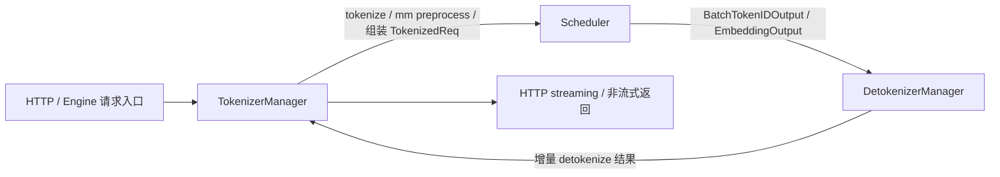
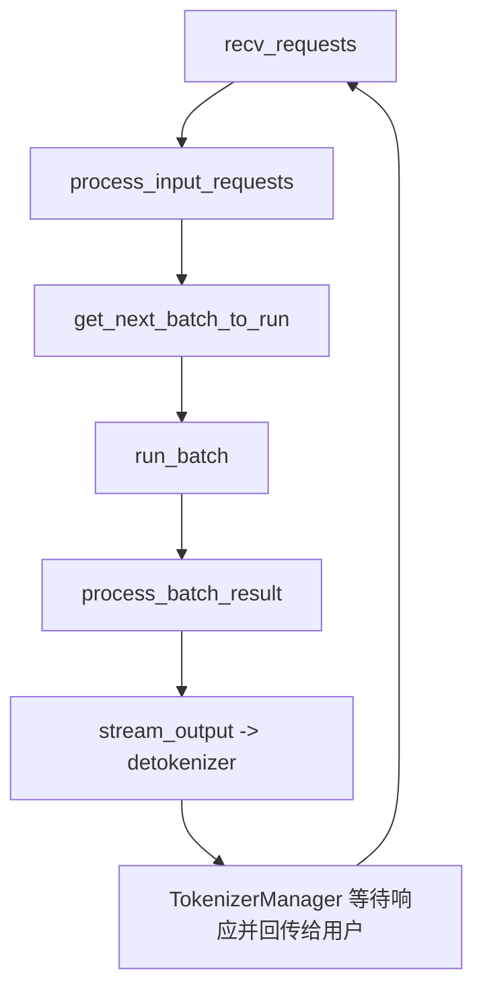
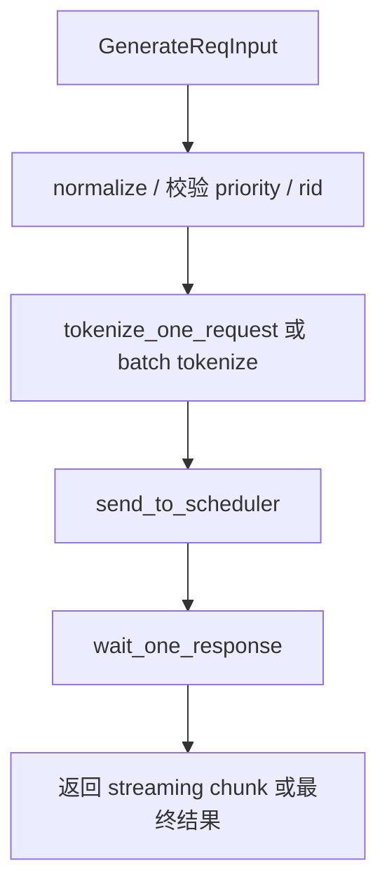
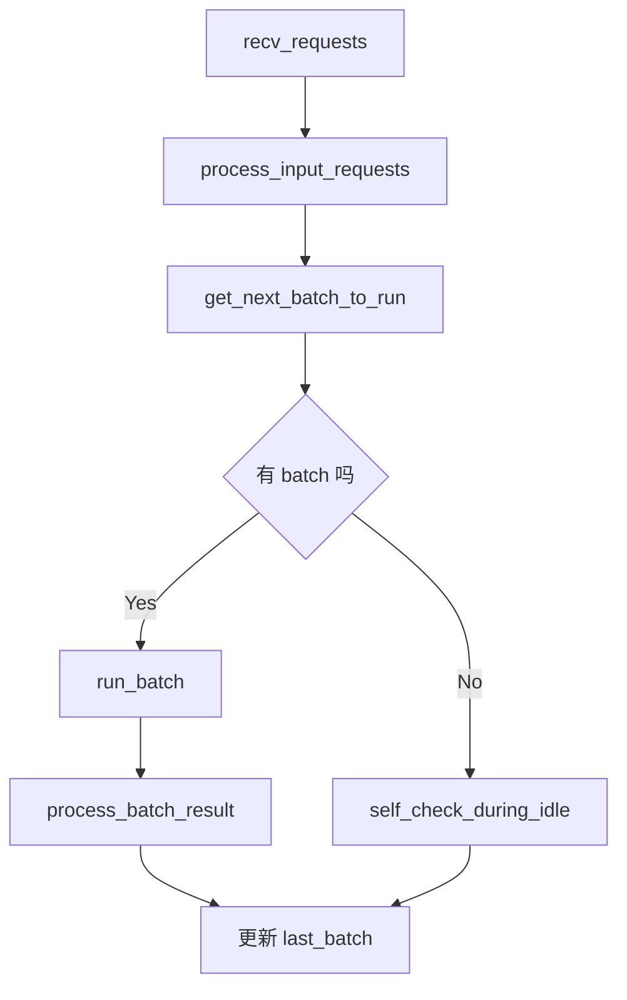
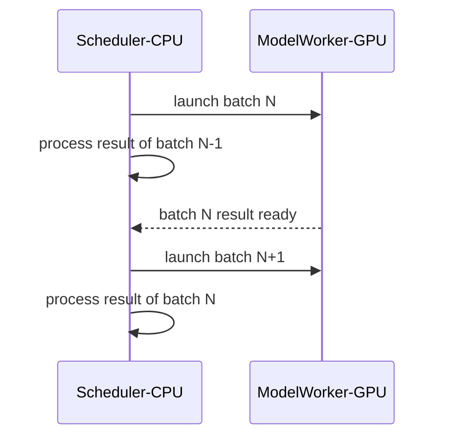
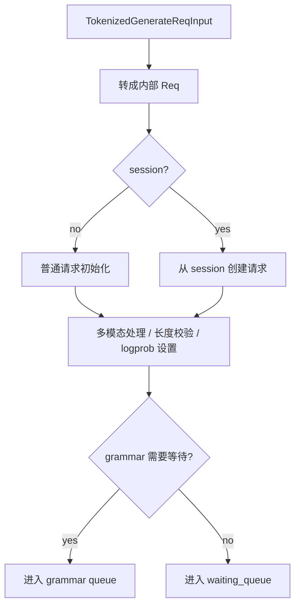
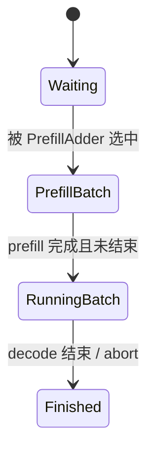
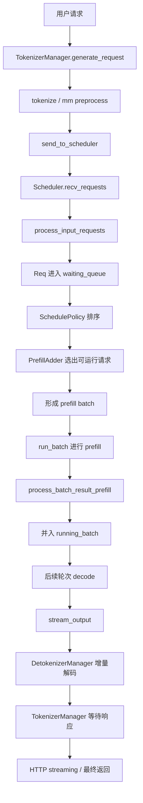

# SGLang 调度过程笔记

## 1. 先看整体：SGLang 的调度不只是“选 batch”

SGLang 的 runtime 里，调度是一个**跨进程、带缓存感知、同时兼顾 prefill / decode / streaming / 分布式并行**的过程。

从 `Engine` 的定义可以先抓住全貌：

- `TokenizerManager`：接收请求、做 tokenize / 多模态预处理、把 tokenized request 发给 scheduler。
- `Scheduler`：核心调度器。负责等待队列、running batch、KV cache、prefill/decode 切换、batch 构造、forward 执行、结果处理。
- `DetokenizerManager`：把 scheduler 输出的 token ids 增量解码成文本，再回给 tokenizer / HTTP 层。

对应源码：

- `python/sglang/srt/entrypoints/engine.py:143`
- `python/sglang/srt/managers/tokenizer_manager.py:176`
- `python/sglang/srt/managers/scheduler.py:270`
- `python/sglang/srt/managers/detokenizer_manager.py:74`

---

## 2. 整体架构图

如果再细化 scheduler 所在主路径：

对应关键函数：

- `python/sglang/srt/managers/scheduler.py:1286`
- `python/sglang/srt/managers/scheduler.py:1545`
- `python/sglang/srt/managers/scheduler.py:2130`
- `python/sglang/srt/managers/scheduler.py:2577`
- `python/sglang/srt/managers/scheduler.py:2752`
- `python/sglang/srt/managers/scheduler_output_processor_mixin.py:854`

---

## 3. 请求进入调度器之前发生了什么

### 3.1 Engine 启动三个核心组件

`Engine` 在初始化时会拉起 tokenizer manager、scheduler 子进程、detokenizer 子进程，并通过 ZMQ IPC 连接起来。

见：

- `python/sglang/srt/entrypoints/engine.py:182`
- `python/sglang/srt/entrypoints/engine.py:204`

这里很重要的一点是：

- **HTTP server / Engine / TokenizerManager 在主进程**
- **Scheduler / DetokenizerManager 在子进程**
- 组件间通信主要不是函数调用，而是 **IPC + ZMQ**

这决定了 scheduler 是一个相对独立的“执行中枢”。

### 3.2 TokenizerManager 把原始请求变成可调度对象

`TokenizerManager.generate_request()` 的主流程是：

1. 规范化请求参数。
2. 记录请求统计信息。
3. 做 tokenize / 多模态处理。
4. 生成 tokenized request。
5. 发送给 scheduler。
6. 异步等待 scheduler / detokenizer 返回结果。

见：

- `python/sglang/srt/managers/tokenizer_manager.py:481`
- `python/sglang/srt/managers/tokenizer_manager.py:519`
- `python/sglang/srt/managers/tokenizer_manager.py:668`

可以画成：

这里的关键认识：

- **TokenizerManager 负责把“用户请求”转成“调度器能理解的 token 级请求”**。
- 真正的 batch 选择、KV cache 复用、prefill/decode 切换，都还没发生。

---

## 4. Scheduler 初始化时准备了哪些调度基础设施

`Scheduler.__init__()` 非常长，但从调度角度可以抓这些核心状态：

1. **分布式并行信息**：TP / PP / DP / attention CP。
2. **IPC 通道**：接收 tokenizer 请求、返回 tokenizer / detokenizer。
3. **model worker**：真正跑 forward 的执行对象。
4. **KV cache / memory pool**。
5. **running status**：当前运行 batch、last batch、waiting queue 等。
6. **chunked prefill**。
7. **schedule policy**。

见：

- `python/sglang/srt/managers/scheduler.py:285`
- `python/sglang/srt/managers/scheduler.py:344`
- `python/sglang/srt/managers/scheduler.py:365`
- `python/sglang/srt/managers/scheduler.py:387`
- `python/sglang/srt/managers/scheduler.py:399`

其中最重要的抽象有三个：

- `waiting_queue`：还没被调度上 GPU 的请求。
- `running_batch`：已经进入 decode 生命周期、还在持续生成的请求集合。
- `tree_cache`：前缀匹配 / radix cache，用来做 prefix cache 命中和 cache-aware scheduling。

---

## 5. Scheduler 主循环：调度的脉搏

Scheduler 有两个核心 event loop：

- 普通模式：`event_loop_normal()`
- overlap 模式：`event_loop_overlap()`

见：

- `python/sglang/srt/managers/scheduler.py:1286`
- `python/sglang/srt/managers/scheduler.py:1314`

### 5.1 普通模式

普通模式非常直白：

1. 收请求。
2. 处理请求。
3. 选下一批。
4. 执行 forward。
5. 处理结果。
6. 更新 `last_batch`。

### 5.2 Overlap 模式

overlap 模式会把：

- 当前 batch 的 GPU forward
- 上一个 batch 的 CPU 侧结果处理

做流水化重叠。

即：**一边让 GPU 跑下一批，一边让 CPU 处理上一批的输出**。

这对吞吐很重要，因为 scheduler 本身是单线程的，CPU 处理太重会拖慢 kernel launch。

见：

- `python/sglang/srt/managers/scheduler.py:1314`
- `python/sglang/srt/managers/scheduler.py:1358`

其思想可以表示为：

这也是 SGLang 调度比较“工程化”的地方：不仅要决定**谁先跑**，还要尽量隐藏 CPU / GPU 两侧的串行开销。

---

## 6. recv_requests：scheduler 如何接收请求

`scheduler.recv_requests()` 做的不只是从一个队列里 pop。

见：`python/sglang/srt/managers/scheduler.py:1406`

它主要负责：

1. 从 tokenizer IPC 拉取请求。
2. 从 RPC 通道拉取控制类请求。
3. 在 TP / DP / CP 场景下广播请求，保证各 rank 看到一致输入。
4. 在多模态 / disaggregation 场景下补充额外处理。

### 6.1 单机直觉版

在最朴素情况下可以理解为：

- scheduler rank0 从 ZMQ 收到 tokenized requests
- 再同步给其他相关 rank

### 6.2 分布式版的关键点

如果开启了 `enable_dp_attention`，请求会拆成：

- `work_reqs`：真正要参与 attention / forward 的工作请求
- `control_reqs`：控制类请求

然后分别在不同 group 上广播。

见：

- `python/sglang/srt/managers/scheduler.py:1458`
- `python/sglang/srt/managers/scheduler.py:1516`

这说明一个很重要的调度事实：

> SGLang 的 scheduler 不是“单卡上排队跑请求”这么简单，它要先把请求分发成一个多并行拓扑中可执行的一致视图。

---

## 7. process_input_requests：收到请求后如何进入 waiting queue

`process_input_requests()` 会遍历本轮收到的请求，并通过 `_request_dispatcher` 分发到不同 handler。

见：`python/sglang/srt/managers/scheduler.py:1545`

核心逻辑：

- health check 特殊处理
- 普通 generate 请求进入 `handle_generate_request()`
- 控制类请求即时处理并可能直接返回 output
- 最后检查 deferred flush 等挂起操作

### 7.1 普通生成请求的处理

`handle_generate_request()` 是“进入调度域”的关键点。

见：`python/sglang/srt/managers/scheduler.py:1680`

它会做这些事：

1. 把 `TokenizedGenerateReqInput` 转成内部 `Req` 对象。
2. 处理 session 请求 / 非 session 请求。
3. 处理多模态输入，必要时扩展 image token。
4. 设置 `max_new_tokens` 上界。
5. 校验 prompt 长度。
6. 处理 logprob 相关配置。
7. 如果用了 grammar，则可能先进入 grammar queue。
8. 否则调用 `_add_request_to_queue(req)` 进入等待队列。

可以表示成：

这里可以记一句非常关键的话：

> **真正排队等待调度的是内部 `Req`，不是 HTTP 请求对象，也不是原始 tokenized input。**

---

## 8. 调度器最核心的问题：下一批跑谁？

这个问题的入口是：`get_next_batch_to_run()`。

见：`python/sglang/srt/managers/scheduler.py:2130`

它的职责可以概括为四步：

1. 清理超时 / finished 状态。
2. 把上一轮 prefill 完成后可继续 decode 的请求并入 `running_batch`。
3. 尝试构造一个新的 **prefill batch**。
4. 如果没有新的 prefill batch，则从 `running_batch` 中取 **decode batch**。

这已经体现了 SGLang 的基本策略：

- **prefill 优先**（只要能组新的 prefill，就尽量先跑）
- 否则继续推进已有 running batch 的 decode

源码里很明确：

- `new_batch is not None` 时优先返回新 prefill batch
- 否则 `update_running_batch(self.running_batch)` 返回 decode batch

见：

- `python/sglang/srt/managers/scheduler.py:2207`
- `python/sglang/srt/managers/scheduler.py:2211`

---

## 9. 为什么要区分 prefill 和 decode

在 LLM 推理里：

- **prefill**：把整个 prompt 喂进去，建立 KV cache。
- **decode**：后续每步通常只生成 1 个 token（或 speculative 的多 token 变体），持续利用已有 KV cache。

两者资源特征不同：

- prefill 通常 token 数大、算子更重、受 prompt 长度影响大。
- decode 单步 token 少，但会持续很多轮，且对 latency / streaming 敏感。

因此 SGLang 的 scheduler 不会把所有请求一视同仁，而是明确管理：

- waiting queue 里等待做 prefill 的请求
- running batch 里已经完成 prefill、后续继续 decode 的请求

这也是整个调度器设计最重要的一条主线。

---

## 10. 新 prefill batch 是怎么挑出来的

新 prefill batch 的入口：`get_new_batch_prefill()` 与 `_get_new_batch_prefill_raw()`。

见：

- `python/sglang/srt/managers/scheduler.py:2238`
- `python/sglang/srt/managers/scheduler.py:2272`

### 10.1 开始挑选前，先处理外围状态

在 `_get_new_batch_prefill_raw()` 里，先做了几件事：

1. 把 grammar queue 中 ready 的请求放回 waiting queue。
2. hierarchical cache 检查事件。
3. 如果 running batch 已满且没有 chunked request，就直接返回空。
4. 计算当前 running batch 大小。
5. 调用调度策略 `self.policy.calc_priority(self.waiting_queue, self.running_batch)` 对 waiting queue 排序。

见：

- `python/sglang/srt/managers/scheduler.py:2275`
- `python/sglang/srt/managers/scheduler.py:2309`

### 10.2 真正做容量决策的是 PrefillAdder

真正决定“还能塞哪些请求”的核心不是 `SchedulePolicy`，而是 `PrefillAdder`。

构造位置：

- `python/sglang/srt/managers/scheduler.py:2326`

它综合考虑：

- page size
- tree cache
- token 到 KV 的内存池 allocator
- running batch 当前状态
- `new_token_ratio`
- `max_prefill_tokens`
- `chunked_prefill_size`
- `max_prefill_bs`
- `max_running_requests`
- `prefill_max_requests`
- prefill delayer
- dllm config

也就是说：

> **SchedulePolicy 决定 waiting queue 的顺序，PrefillAdder 决定按这个顺序到底能装进去多少请求。**

这个区分非常重要。

---

## 11. SchedulePolicy：waiting queue 的排序逻辑

`SchedulePolicy` 负责对 waiting queue 排序。

见：`python/sglang/srt/managers/schedule_policy.py:96`

它支持两类策略：

### 11.1 Cache-agnostic 策略

不关心 prefix cache 命中，只按通用规则排序：

- `FCFS`
- `LOF`（longest output first）
- `RANDOM`
- `ROUTING_KEY`

见：

- `python/sglang/srt/managers/schedule_policy.py:144`
- `python/sglang/srt/managers/schedule_policy.py:281`
- `python/sglang/srt/managers/schedule_policy.py:315`

### 11.2 Cache-aware 策略

考虑 prefix cache 命中情况：

- `LPM`：longest prefix match
- `DFS_WEIGHT`

见：

- `python/sglang/srt/managers/schedule_policy.py:130`
- `python/sglang/srt/managers/schedule_policy.py:245`
- `python/sglang/srt/managers/schedule_policy.py:259`

### 11.3 Prefix matching 是怎么参与调度的

`_compute_prefix_matches()` 会：

1. 用 `tree_cache.match_prefix()` 查每个请求已命中的前缀。
2. 把命中信息写回 `req.prefix_indices / req.last_node` 等字段。
3. 额外做一层 in-batch prefix caching 检查，避免大量相似短前缀请求同时进 batch 导致效果不佳。

见：

- `python/sglang/srt/managers/schedule_policy.py:185`
- `python/sglang/srt/managers/schedule_policy.py:199`
- `python/sglang/srt/managers/schedule_policy.py:216`

所以从机制上看：

> SGLang 的调度不是简单 FIFO，而是明显带有“让 prefix cache 更赚钱”的倾向。

---

## 12. PrefillAdder：真正的装箱器

在 `_get_new_batch_prefill_raw()` 中，waiting queue 是按顺序遍历的，但能不能进 batch，要看 `adder.add_one_req()` 的结果。

见：

- `python/sglang/srt/managers/scheduler.py:2351`
- `python/sglang/srt/managers/scheduler.py:2394`

它会受这些因素制约：

- 当前 running batch 已占多少资源。
- token / KV cache pool 剩余空间。
- prefill token 上限。
- batch size 上限。
- chunked prefill 状态。
- LoRA batch 兼容性。
- hierarchical cache prefetch 是否完成。
- priority preemption 是否允许把旧请求重新入队。

最终会得到：

- `adder.can_run_list`：这轮能进入新 prefill batch 的请求。
- `adder.preempt_list`：需要被抢占重新排队的请求。
- `adder.new_chunked_req`：如果某个长请求被切块，只推进一部分，剩下的留到后续轮次。

然后 scheduler：

1. 从 waiting queue 中移除 `can_run_list`。
2. 把 `preempt_list` 放回等待队列。
3. 更新 `chunked_req`。
4. 用 `ScheduleBatch.init_new(...)` 构造新的 prefill batch。

见：

- `python/sglang/srt/managers/scheduler.py:2415`
- `python/sglang/srt/managers/scheduler.py:2441`

### 12.1 用一句话概括 PrefillAdder

> `PrefillAdder` 是 SGLang prefill 调度的“容量裁判”，负责在当前显存 / KV cache / batch 约束下，决定 waiting queue 前缀中的哪些请求能安全且高效地上车。

---

## 13. chunked prefill：长 prompt 不是一次全吞

SGLang 支持 chunked prefill。直观理解就是：

- 对超长 prompt，不一定一次性把全部 prefill 都做完。
- 可以先跑一部分，剩余部分后续轮次继续。

在 `_get_new_batch_prefill_raw()` 里可以看到：

- `self.chunked_req` 会被特殊处理。
- 如果开启动态 chunking，会根据历史长度预测下一块大小。

见：

- `python/sglang/srt/managers/scheduler.py:2317`
- `python/sglang/srt/managers/scheduler.py:2343`
- `python/sglang/srt/managers/scheduler.py:2426`

这背后的调度意义是：

- 避免超长请求长期霸占 prefill 资源。
- 在 TTFT 与整体吞吐之间做平衡。
- 让长请求和短请求能更温和地共存。

---

## 14. 从 prefill batch 到 running_batch

`get_next_batch_to_run()` 一开始有一个重要动作：

- 把上一轮 prefill 完成后还没 finished 的请求并入 `running_batch`

见：

- `python/sglang/srt/managers/scheduler.py:2136`
- `python/sglang/srt/managers/scheduler.py:2177`

这一步的意义是：

- **prefill batch 是新进入系统的一批请求**
- **running_batch 是已经建立好上下文、准备继续 decode 的长期集合**

可以理解成状态迁移：

所以 running batch 不是临时 batch，而更像“活跃生成会话的集合”。

---

## 15. 如果没有新的 prefill，就继续 decode

当 `new_batch is None` 时，scheduler 会尝试推进 `running_batch`：

- `self.running_batch = self.update_running_batch(self.running_batch)`
- 如果更新后非空，就返回这个 decode batch

见：`python/sglang/srt/managers/scheduler.py:2211`

可以把 SGLang 每轮调度理解成一个简单优先级：

1. 先看有没有值得做的新 prefill。
2. 没有的话，就推进当前活跃请求的 decode。

这是一种偏向兼顾首 token 延迟（TTFT）的策略。因为新请求不至于一直被老 decode 流拖死。

---

## 16. run_batch：调度决定之后，真正执行 forward

选出 batch 后，`run_batch()` 负责把 `ScheduleBatch` 交给 model worker 执行。

见：`python/sglang/srt/managers/scheduler.py:2577`

### 16.1 生成模型的主路径

对 generation 请求，核心逻辑是：

1. 把 `ScheduleBatch` 转成 `model_worker_batch`。
2. 调用 `model_worker.forward_batch_generation(...)`。
3. 拿到 `next_token_ids` 或 speculative 相关结果。
4. 更新 batch 的输出字段。
5. 在需要时更新 cache / active ranks 等信息。

见：

- `python/sglang/srt/managers/scheduler.py:2599`
- `python/sglang/srt/managers/scheduler.py:2625`
- `python/sglang/srt/managers/scheduler.py:2665`
- `python/sglang/srt/managers/scheduler.py:2675`

### 16.2 overlap 下会做额外处理

如果开启 overlap：

- forward 在 `forward_stream` 上跑
- 结果会拷回 CPU
- 用 `future_map` 保存未来可解析结果
- 某些 sample 可以延后执行

见：

- `python/sglang/srt/managers/scheduler.py:2609`
- `python/sglang/srt/managers/scheduler.py:2619`
- `python/sglang/srt/managers/scheduler.py:2632`
- `python/sglang/srt/managers/scheduler.py:2727`

从调度视角看，这说明 scheduler 的职责不只到“选好 batch”为止，它还负责：

- 让 batch 以合适的 stream / overlap 方式执行
- 为后续 output processing 保留足够上下文

---

## 17. process_batch_result：forward 结束后怎么回写状态

`process_batch_result()` 会按 batch 类型分别处理：

- decode result
- prefill result
- disaggregation prefill result
- prebuilt / idle result

见：`python/sglang/srt/managers/scheduler.py:2752`

核心作用是：

1. 把 forward 输出写回请求状态。
2. 更新 finished / output_ids / logprobs / cache 相关状态。
3. 决定哪些请求此时应该 stream 输出。
4. 清理多模态输入。
5. 发送健康检查信号。

也就是说，**调度闭环并不是 run_batch 结束，而是 process_batch_result 把执行结果重新折叠回 Req / batch 状态。**

---

## 18. stream_output：什么时候把结果往外吐

真正把结果发往 detokenizer 的入口是：

- `python/sglang/srt/managers/scheduler_output_processor_mixin.py:854`

对于生成任务，会走 `stream_output_generation()`。

见：

- `python/sglang/srt/managers/scheduler_output_processor_mixin.py:882`

它会按每个 req 决定此刻是否该输出：

- 如果请求 finished，则通常要输出最终结果。
- 如果请求开启 streaming，则按照 `stream_interval` 做增量输出。
- 否则也可能按强制间隔输出，避免长时间无回传。

然后收集：

- rids
- decode ids
- output ids
- finished reasons
- logprobs
- cached token 统计
- timing 统计

再发给 detokenizer。

所以这里有个很关键的认识：

> **scheduler 并不是每跑一步都必然把每个请求的结果往外发，而是会按 stream 策略做节流与增量组织。**

---

## 19. DetokenizerManager：把 token ids 变回文本

DetokenizerManager 的 event loop 非常简单：

1. 从 scheduler 拉结果对象。
2. 按类型分发处理。
3. 做 batch decode / 增量 detokenize。
4. 发回 tokenizer manager。

见：

- `python/sglang/srt/managers/detokenizer_manager.py:144`
- `python/sglang/srt/managers/detokenizer_manager.py:225`

这里维护了 `decode_status`，用于：

- 追踪每个请求已经解到哪里
- 支持增量解码
- 正确裁掉 stop token / stop string

最终，TokenizerManager 那边等待响应的协程会拿到结果，再通过 HTTP streaming 或一次性返回给用户。

---

## 20. 一次请求的完整生命周期图

---

## 21. 这个调度器最值得记住的 8 个关键点

### 21.1 Scheduler 是 runtime 核心，而不是普通队列消费者

它同时管：

- 请求接入后的内部对象化
- waiting / running 状态流转
- prefix cache
- prefill / decode
- overlap
- 分布式同步
- streaming 输出

### 21.2 waiting queue 与 running batch 是两套状态

- `waiting_queue`：等待首次 prefill
- `running_batch`：已经进入持续 decode 的活跃请求

这是理解 SGLang 调度最核心的状态划分。

### 21.3 调度不是只有一种策略，而是“两层决策”

第一层：`SchedulePolicy`

- 决定 waiting queue 顺序

第二层：`PrefillAdder`

- 决定在资源限制下到底选哪些请求组成 batch

### 21.4 Prefix cache 直接参与调度

`tree_cache.match_prefix()` 不只是执行时用来命中缓存，也会反过来影响 waiting queue 排序。

这让 SGLang 的调度是明显 **cache-aware** 的。

### 21.5 Prefill 优先于 decode

每轮调度会先尝试新 prefill batch；不行再推进 running batch 的 decode。

这会影响：

- 新请求的 TTFT
- 老请求 decode 的平滑性
- 整体系统吞吐

### 21.6 长请求可被 chunked prefill

超长 prompt 不必一次吞下，而是可分块推进，从而减少单个请求对系统的阻塞。

### 21.7 Overlap 是吞吐优化关键

GPU 跑当前 batch 的同时，CPU 处理上一 batch 结果，减少串行空泡。

### 21.8 输出也是调度的一部分

何时 stream、每次发多少、何时 detokenize，并不是附属问题，而是整个调度闭环的一部分。

---

## 22. 如果你要继续深挖，建议按这条线读源码

### 第一层：先建立整体心智模型

- `python/sglang/srt/entrypoints/engine.py:139`
- `python/sglang/srt/managers/tokenizer_manager.py:481`
- `python/sglang/srt/managers/scheduler.py:1286`
- `python/sglang/srt/managers/detokenizer_manager.py:144`

### 第二层：专读 batch 选择

- `python/sglang/srt/managers/scheduler.py:2130`
- `python/sglang/srt/managers/scheduler.py:2238`
- `python/sglang/srt/managers/scheduler.py:2272`
- `python/sglang/srt/managers/schedule_policy.py:96`

### 第三层：专读执行与输出回写

- `python/sglang/srt/managers/scheduler.py:2577`
- `python/sglang/srt/managers/scheduler.py:2752`
- `python/sglang/srt/managers/scheduler_output_processor_mixin.py:854`

### 第四层：如果关注分布式/高级特性，再继续读

- DP attention 相关分支：`python/sglang/srt/managers/scheduler.py:1458`
- overlap 调度：`python/sglang/srt/managers/scheduler.py:1314`
- chunked prefill：`python/sglang/srt/managers/scheduler.py:2317`
- session/cache 关系：`python/sglang/srt/managers/session_controller.py`

---

## 23. 最后给一个极简总结

可以把 SGLang 调度过程压缩成一句话：

> **TokenizerManager 把请求变成 token 级任务；Scheduler 基于 waiting queue、running batch、prefix cache 和显存/KV 约束，优先构造 prefill batch，否则推进 decode batch；forward 完成后再通过 detokenizer 把增量结果回传出去。**

如果再压缩成 5 个词：

> **接入 → 排队 → 选批 → 执行 → 回传**
