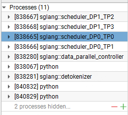
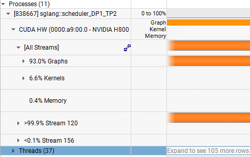
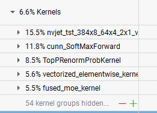

# 关于NVIDIA Nsights system(NSYS)的学习笔记

本笔记目前主要记录笔者在使用NSYS来对推理引擎进行profile时候的一些学习记录。

## 1. 使用方法

## 2. Profile与可视化

### 2.1 侧边栏

以SGLang，4卡，开DP=2 attn_tp_size=2 为例

会展现不同的Rank的线程，其中在DP0为1个shard，DP1为1个shard。除此以外，还会存在一些其他的进程，例如controller，detokenizer (等待继续探索学习~)

展开以后

会显示该线程下的CUDA HW（真正的CUDA Runtime 可以来看GPU利用率）以及Threads（里面会有大量的schedule线程），我们可以看到图中在CUDA HW右侧有Graph、Kernel、Memory。其中Graph是Cuda Graph Replay执行的部分，这部分通常较为完整（因为把一整系列操作录制成了Cuda Graph）。下面是Kernel，为实际上CUDA Kernel执行的细节（如果不开Graph的话可以看到详细的Kernel运行流）。最下面是Memory，具体为D2H H2D等操作。

展开Graph后可以看到详细执行的是哪些图（例如Graph 139..），展开Kernel后则可以看到Kernel运行占比。

etc..